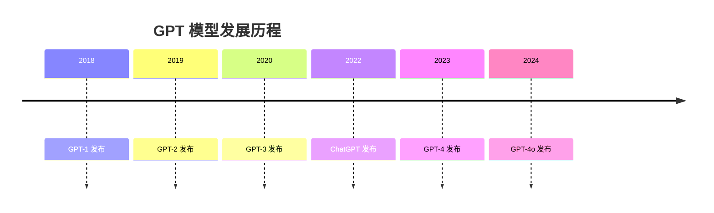

# 什么是 ChatGPT？

::: tip 导读
本文将全面介绍 ChatGPT 的基本概念、发展历程、技术原理以及它为何能够成为全球最受欢迎的 AI 工具。
:::

## 基本定义

**ChatGPT**（Chat Generative Pre-trained Transformer）是由 OpenAI 开发的一款基于大型语言模型的人工智能聊天机器人。它能够：

- 🗣️ 进行自然的对话交流
- 📝 生成各种类型的文本内容
- 💡 回答问题和提供建议
- 🔧 协助完成各种任务

## 发展历程

### GPT 系列的演进



### 重要里程碑

| 时间 | 事件 | 重要性 |
|------|------|--------|
| 2022年11月 | ChatGPT 公开发布 | 引发全球 AI 热潮 |
| 2023年3月 | GPT-4 发布 | 性能大幅提升 |
| 2023年11月 | GPT-4 Turbo 发布 | 更快更便宜 |
| 2024年5月 | GPT-4o 发布 | 多模态能力增强 |

## 核心技术

### Transformer 架构

ChatGPT 基于 **Transformer** 架构，这是一种专门用于处理序列数据的神经网络结构。

**关键特点：**
- 🎯 注意力机制（Attention Mechanism）
- 🔄 并行处理能力
- 📊 大规模预训练
- 🎓 持续学习优化

### 训练方式

ChatGPT 的训练分为三个主要阶段：

1. **预训练（Pre-training）**
   - 在海量文本数据上进行无监督学习
   - 学习语言的基本结构和知识

2. **监督微调（Supervised Fine-tuning）**
   - 使用人工标注的高质量对话数据
   - 学习如何更好地响应用户需求

3. **强化学习（RLHF）**
   - 基于人类反馈的强化学习
   - 不断优化回答质量

## 主要特点

### 1. 强大的语言理解能力

ChatGPT 能够理解复杂的自然语言输入，包括：
- 多轮对话上下文
- 隐含意图和需求
- 不同语言和方言
- 专业术语和俚语

### 2. 多样的内容生成

可以生成各种类型的内容：

::: code-group
```markdown [文章写作]
- 博客文章
- 新闻稿件
- 学术论文
- 创意故事
```

```python [代码编写]
# 示例：生成 Python 代码
def fibonacci(n):
    if n <= 1:
        return n
    return fibonacci(n-1) + fibonacci(n-2)
```

```text [其他内容]
- 邮件和信函
- 广告文案
- 诗歌和歌词
- 剧本和对话
```
:::

### 3. 广泛的知识覆盖

ChatGPT 的知识库涵盖：
- 📚 科学技术
- 🎨 艺术文化
- 💼 商业管理
- 🏥 医疗健康
- 📖 历史地理
- 🎓 教育培训

### 4. 持续的学习能力

虽然模型本身不会在对话中学习，但 OpenAI 会定期更新模型，加入新的知识和能力。

## 与其他 AI 的区别

### ChatGPT vs 传统搜索引擎

| 对比维度 | ChatGPT | 搜索引擎 |
|---------|---------|----------|
| 交互方式 | 对话式 | 关键词搜索 |
| 结果呈现 | 直接答案 | 网页链接 |
| 个性化 | 根据对话调整 | 基于搜索历史 |
| 内容生成 | ✅ 可以 | ❌ 不可以 |

### ChatGPT vs 其他 AI 助手

**优势：**
- ✅ 更强的创作能力
- ✅ 更自然的对话体验
- ✅ 更广泛的应用场景
- ✅ 持续快速更新

**劣势：**
- ⚠️ 知识截止日期限制
- ⚠️ 可能产生幻觉（编造信息）
- ⚠️ 无法联网（免费版）

## 为什么 ChatGPT 如此受欢迎？

### 1. 易用性

- 无需编程知识
- 自然语言交互
- 即问即答

### 2. 实用性

满足多种实际需求：
- 🎯 工作效率提升
- 📚 学习辅助
- 💡 创意激发
- 🔧 问题解决

### 3. 可访问性

- 免费版本可用
- 网页版和 APP 均支持
- 国内有镜像站点

### 4. 持续进化

- 定期功能更新
- 新模型发布
- 生态系统扩展

## 应用场景示例

### 办公场景

```markdown
# 邮件撰写
让 ChatGPT 帮你起草专业邮件

# 数据分析
上传数据文件，让 AI 帮你分析

# PPT 大纲
快速生成演讲稿和幻灯片框架
```

### 学习场景

- 📖 概念解释和知识问答
- 🔬 科研论文总结
- 🌍 外语学习和翻译
- 📝 作业辅导（注意学术诚信）

### 创作场景

- ✍️ 小说和剧本创作
- 🎨 营销文案撰写
- 🎵 歌词和诗歌创作
- 🎬 视频脚本构思

## 局限性和注意事项

### 知识局限

::: warning 注意
ChatGPT 的知识有截止日期，无法获取最新的实时信息（除非使用联网功能）。
:::

### 可能的错误

- ❌ 事实性错误（"幻觉"）
- ❌ 计算错误
- ❌ 逻辑漏洞
- ❌ 过时信息

### 使用建议

::: tip 最佳实践
1. **关键信息需验证** - 不要盲目相信
2. **明确你的需求** - 提供详细的上下文
3. **迭代式对话** - 通过追问完善答案
4. **保护隐私** - 不要输入敏感信息
:::

## 总结

ChatGPT 代表了人工智能技术的重大突破，它：

- ✅ 将 AI 技术带入大众视野
- ✅ 极大提升了工作和学习效率
- ✅ 开启了人机交互的新时代
- ✅ 为未来的 AI 应用奠定基础

无论你是学生、职场人士还是创作者，ChatGPT 都能成为你的得力助手。

---

**下一步：** [如何使用 ChatGPT](/chatgpt/how-to-use-chatgpt) - 学习如何充分发挥 ChatGPT 的能力

