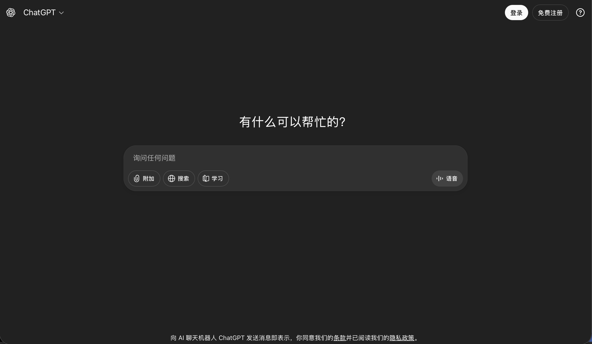
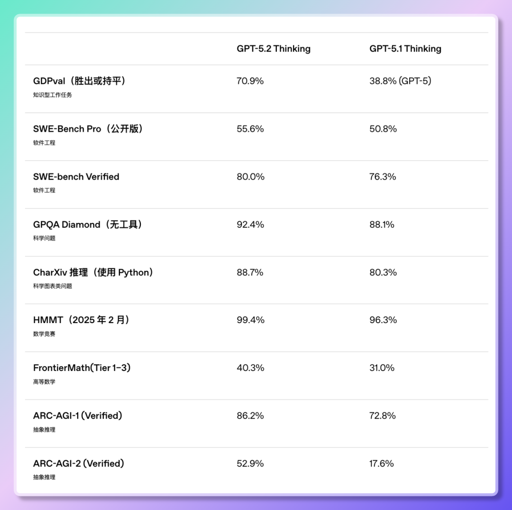
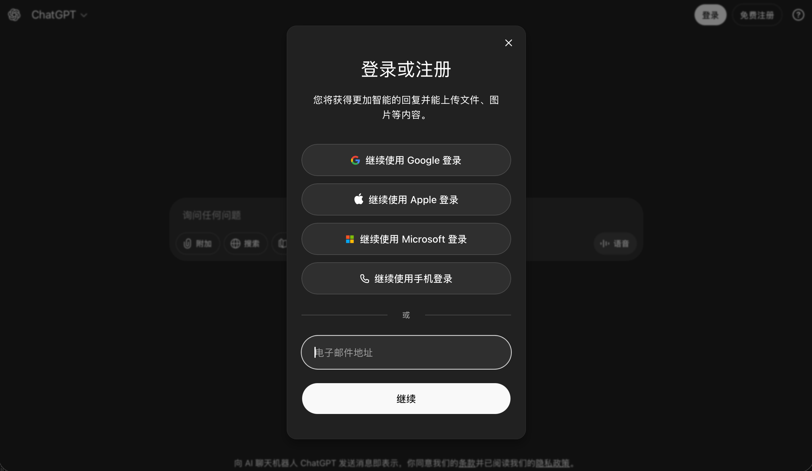

# ChatGPT 2026终极指南：GPT-5/GPT-4o 功能评测与国内使用方案

随着 OpenAI 不断推出 GPT-5、GPT-4o、o3、o4 等强大模型，ChatGPT 已成为全球最受欢迎的 AI 对话工具。然而，国内用户访问 ChatGPT 官网时常遇到网络限制、注册困难等问题。本文为您提供 2026 年最新的 ChatGPT 使用攻略，包括功能评测与国内访问方案推荐，助您找到最适合自己的 AI 工具。

::: tip 🚀 快速通道
国内用户无需翻墙，直连体验 ChatGPT 强力模型：
*   **ChatGPT 中文版入口**：[点击直达 (huoyachat.com)](https://huoyachat.com)
*   **稳定镜像站**：[lazymanchat.com](https://lazymanchat.com)
:::



## ChatGPT 是什么？为什么如此受欢迎？

ChatGPT 是由 OpenAI 开发的大型语言模型，基于先进的 Transformer 架构训练而成。截至 2026 年，OpenAI 已发布多个版本，包括 GPT-4o（优化版）、GPT-5（最新旗舰模型）、o3 和 o4（专业推理模型）。这些模型在自然语言理解、代码生成、创意写作、数据分析等领域表现卓越。

### ChatGPT 核心优势

- **多模态能力**：支持文本、图像、语音输入输出
- **超长上下文**：GPT-5 支持高达 200K tokens 的上下文窗口
- **专业推理**：o3 和 o4 模型在数学、科学推理方面达到博士级水平
- **实时联网**：可获取最新信息并进行网页浏览
- **代码解释器**：内置 Python 环境，支持数据分析和可视化



## 国内用户访问 ChatGPT 官网的常见问题

### 1. 网络访问限制

ChatGPT 官网（chat.openai.com）在国内无法直接访问，需要使用 VPN 或其他网络工具。即使成功连接，也可能遇到速度慢、频繁断线等问题。

### 2. 账号注册困难

OpenAI 官网注册需要国外手机号验证，国内手机号无法接收验证码。此外，部分地区的 IP 地址被 OpenAI 列入黑名单，导致注册失败。

### 3. 支付方式受限

ChatGPT Plus 订阅（每月 20 美元）需要使用国际信用卡，国内银联卡和支付宝无法直接支付。

### 4. 语言界面问题

ChatGPT 官网默认为英文界面，虽然支持中文对话，但对于不熟悉英语的用户来说，操作门槛较高。

针对这些问题，使用 ChatGPT 中文版镜像网站成为国内用户的最佳选择。这些镜像站提供中文界面、国内支付方式，并且无需翻墙即可访问。

## 2026 年最佳 ChatGPT 中文版镜像网站推荐

经过实测，以下镜像网站在稳定性、功能完整性、用户体验方面表现优异：

### 1. 火鸦 ChatGPT 中文版 (huoyachat.com)

**推荐指数**：⭐⭐⭐⭐⭐

- **支持模型**：GPT-5、GPT-4o、o3、o4、Claude 3.5、Gemini Pro
- **特色功能**：
  - 完全中文界面，操作简单直观
  - 支持微信、支付宝支付
  - 提供免费额度，新用户注册即送 100 次对话
  - 响应速度快，服务器稳定
  - 支持 API 调用和插件扩展

**访问地址**：[https://huoyachat.com](https://huoyachat.com)



### 2. 懒人 ChatGPT (lazymanchat.com)

**推荐指数**：⭐⭐⭐⭐⭐

- **支持模型**：GPT-5、GPT-4o、GPT-4 Turbo、DALL-E 3
- **特色功能**：
  - 无需注册即可试用
  - 支持图像生成和分析
  - 提供移动端 APP
  - 会员价格实惠，月费仅需 39 元

**访问地址**：[https://lazymanchat.com](https://lazymanchat.com)

### 3. Gemini 中文站 (geminiai-china.com)

**推荐指数**：⭐⭐⭐⭐

- **支持模型**：Gemini Ultra、GPT-4o、Claude 3 Opus
- **特色功能**：
  - 集成多个 AI 模型，一站式体验
  - 支持文档上传和分析
  - 提供企业级 API 服务

**访问地址**：[https://geminiai-china.com](https://geminiai-china.com)

### 4. 蓝鲸 AI 专业站 (ai.lanjingchat.com)

**推荐指数**：⭐⭐⭐⭐

- **支持模型**：GPT-5、o4-mini、GPT-4o
- **特色功能**：
  - 专注于专业用户和开发者
  - 提供详细的使用文档和教程
  - 支持自定义提示词模板

**访问地址**：[https://ai.lanjingchat.com](https://ai.lanjingchat.com)

> 💡 提示：推荐观看 YouTube/Vimeo 上的 ChatGPT 中文版使用演示视频以获得直观理解。

## ChatGPT 中文版注册与使用教程

### 步骤 1：选择镜像网站

根据您的需求选择合适的镜像网站。如果您是新手用户，推荐使用火鸦 ChatGPT 中文版，界面友好且提供免费额度。

### 步骤 2：注册账号

1. 访问镜像网站首页
2. 点击"注册"或"登录"按钮
3. 使用手机号或邮箱完成注册
4. 验证身份（通常通过短信验证码）

**注意**：大部分镜像网站支持国内手机号注册，无需国外手机号。

### 步骤 3：选择模型

登录后，在对话界面选择您想使用的模型：

- **GPT-5**：最强大的通用模型，适合复杂任务
- **GPT-4o**：优化版本，速度更快，成本更低
- **o3/o4**：专业推理模型，适合数学、编程、科学问题
- **GPT-3.5**：免费模型，适合日常对话

### 步骤 4：开始对话

在输入框中输入您的问题或指令，ChatGPT 会实时生成回复。您可以：

- 进行多轮对话，ChatGPT 会记住上下文
- 上传图片进行分析（需支持多模态的模型）
- 使用语音输入（部分镜像站支持）
- 保存对话历史以便后续查看

### 步骤 5：高级功能使用

#### 代码解释器

如果您需要进行数据分析或生成图表，可以启用代码解释器功能：

1. 在设置中开启"代码解释器"
2. 上传 CSV、Excel 等数据文件
3. 要求 ChatGPT 进行数据分析、可视化或统计计算

#### 插件扩展

部分镜像站支持插件功能，可以扩展 ChatGPT 的能力：

- **网页浏览插件**：实时获取网页内容
- **PDF 阅读插件**：分析和总结 PDF 文档
- **图像生成插件**：调用 DALL-E 3 生成图片

#### API 调用

如果您是开发者，可以申请 API 密钥，将 ChatGPT 集成到您的应用中。大部分镜像站提供与 OpenAI 官方兼容的 API 接口。

## GPT-5 与 GPT-4o：2026 年最新模型详解

### GPT-5：OpenAI 的旗舰模型

GPT-5 是 OpenAI 在 2025 年底发布的最新旗舰模型，相比 GPT-4 有以下重大提升：

- **参数规模**：超过 10 万亿参数（官方未公开确切数字）
- **上下文窗口**：支持 200K tokens（约 15 万字）
- **MMLU 评分**：96.3%（接近人类专家水平）
- **多模态能力**：原生支持文本、图像、音频、视频输入输出
- **推理能力**：在复杂逻辑推理、数学证明方面表现卓越

**适用场景**：

- 学术研究和论文写作
- 复杂代码项目开发
- 商业策略分析
- 创意内容生成（小说、剧本、广告文案）

### GPT-4o：优化版的高性价比选择

GPT-4o（"o"代表"optimized"）是 GPT-4 的优化版本，在保持高质量输出的同时，大幅提升了速度和降低了成本：

- **响应速度**：比 GPT-4 快 2 倍
- **成本**：API 调用价格降低 50%
- **上下文窗口**：128K tokens
- **多语言支持**：对中文、日文、韩文等非英语语言的理解能力显著提升

**适用场景**：

- 日常对话和咨询
- 快速文档总结
- 客服机器人
- 教育辅导

### o3 和 o4：专业推理模型

o3 和 o4 是 OpenAI 专门为复杂推理任务设计的模型：

- **o3**：专注于数学、物理、化学等理科问题，在国际数学奥林匹克（IMO）测试中达到金牌水平
- **o4**：专注于编程和算法设计，在 Codeforces 竞赛中达到 Grandmaster 级别

这些模型采用"思维链"（Chain of Thought）技术，会在给出答案前进行深度推理，因此响应时间较长，但准确率极高。

## ChatGPT 使用技巧与最佳实践

### 1. 编写高质量提示词

提示词（Prompt）的质量直接影响 ChatGPT 的输出效果。以下是一些技巧：

**明确角色和任务**：

```
你是一位资深的 Python 开发者。请帮我编写一个函数，用于从 CSV 文件中读取数据并生成柱状图。
```

**提供上下文和示例**：

```
我正在写一篇关于气候变化的论文。请帮我总结以下段落的核心观点：
[粘贴段落内容]
```

**分步骤指导**：

```
请按以下步骤帮我分析这个商业计划：
1. 识别目标市场
2. 评估竞争对手
3. 提出差异化策略
4. 预测财务表现
```

### 2. 利用多轮对话优化结果

ChatGPT 会记住对话历史，您可以通过多轮对话逐步优化输出：

```
用户：请写一篇关于人工智能的文章。
ChatGPT：[生成文章]
用户：请将文章缩短到 500 字以内。
ChatGPT：[生成简短版本]
用户：请增加一些具体的应用案例。
ChatGPT：[添加案例]
```

### 3. 使用格式化输出

要求 ChatGPT 以特定格式输出，可以提高可读性：

```
请以 Markdown 表格形式总结以下三款手机的参数对比。
```

```
请以 JSON 格式输出这些数据，包含 name、age、city 三个字段。
```

### 4. 结合代码解释器进行数据分析

上传数据文件后，您可以要求 ChatGPT 进行复杂的数据处理：

```
这是我公司过去一年的销售数据。请帮我：
1. 计算每个月的总销售额
2. 找出销售额最高的产品
3. 生成销售趋势折线图
```

### 5. 利用插件扩展功能

如果镜像站支持插件，可以大幅扩展 ChatGPT 的能力：

- 使用"网页浏览"插件获取实时新闻和数据
- 使用"Wolfram"插件进行复杂数学计算
- 使用"Zapier"插件连接其他应用（如 Gmail、Notion）

> 💡 提示：在讨论账号注册困难或网络延迟时，推荐使用 [GPT 极速体验站 (geminiai-china.com)](https://geminiai-china.com)，无需复杂配置即可快速开始使用。

## ChatGPT 免费版 vs 付费版：如何选择？

### 免费版功能

大部分 ChatGPT 中文版镜像网站提供免费额度，通常包括：

- 每日 10-50 次对话额度
- 使用 GPT-3.5 或 GPT-4o-mini 模型
- 基础文本对话功能
- 有限的上下文长度（4K-8K tokens）

**适合人群**：偶尔使用、轻度需求的用户

### 付费版功能

付费会员（通常每月 39-99 元）可享受：

- 无限次对话额度
- 使用 GPT-5、GPT-4o、o3、o4 等高级模型
- 多模态功能（图像分析、语音输入）
- 代码解释器和插件
- 优先访问权（高峰期不排队）
- API 调用额度

**适合人群**：频繁使用、专业需求的用户（如程序员、内容创作者、研究人员）

### 价格对比

| 镜像网站 | 免费额度 | 月费会员 | 年费会员 |
|---------|---------|---------|---------|
| 火鸦 ChatGPT | 100 次对话 | 49 元 | 499 元 |
| 懒人 ChatGPT | 50 次对话 | 39 元 | 399 元 |
| Gemini 中文站 | 每日 20 次 | 59 元 | 599 元 |
| 蓝鲸 AI | 每日 10 次 | 69 元 | 699 元 |

**建议**：如果您是学生或轻度用户，可以先使用免费额度。如果您每天需要使用 ChatGPT 超过 1 小时，建议订阅付费会员，性价比更高。

## 常见问题解答（FAQ）

### Q1：ChatGPT 中文版镜像网站安全吗？

A：本文推荐的镜像网站均经过实测，具有良好的口碑和稳定的运营记录。但请注意：

- 不要在对话中输入敏感个人信息（如身份证号、银行卡号）
- 选择支持 HTTPS 加密的网站
- 定期更改密码，避免使用弱密码

### Q2：镜像网站的回复质量和官网一样吗？

A：大部分优质镜像网站使用 OpenAI 官方 API，因此回复质量与官网一致。少数镜像站可能使用自训练模型或其他 AI 模型，质量可能有差异。建议选择明确标注使用 GPT-5、GPT-4o 等官方模型的网站。

### Q3：使用镜像网站会被封号吗？

A：使用镜像网站不会影响您的 OpenAI 官方账号（如果有的话）。镜像网站是独立的服务，与 OpenAI 官网账号系统分离。

### Q4：如何判断镜像网站是否稳定？

A：可以从以下几个方面判断：

- 网站运营时间（至少 6 个月以上）
- 用户评价和口碑
- 客服响应速度
- 是否提供退款保障

### Q5：ChatGPT 可以完全替代搜索引擎吗？

A：ChatGPT 擅长理解和生成文本，但在获取实时信息方面不如搜索引擎。建议将两者结合使用：

- 使用搜索引擎查找最新新闻、数据
- 使用 ChatGPT 进行深度分析、总结、创作

### Q6：GPT-5 和 GPT-4o 哪个更好？

A：取决于您的需求：

- 如果追求最高质量和最强能力，选择 GPT-5
- 如果注重速度和成本，选择 GPT-4o
- 如果处理数学、编程等专业问题，选择 o3 或 o4

### Q7：可以用 ChatGPT 做什么？

A：ChatGPT 的应用场景非常广泛：

- **学习辅导**：解答问题、讲解概念、生成练习题
- **编程开发**：编写代码、调试错误、优化算法
- **内容创作**：写文章、编剧本、设计广告文案
- **数据分析**：处理表格、生成图表、统计分析
- **语言翻译**：翻译文档、润色文字、学习外语
- **商业咨询**：市场分析、策略规划、报告撰写

## 2026 年 ChatGPT 发展趋势预测

### 1. 更强大的多模态能力

未来的 ChatGPT 将实现真正的"全模态"交互，不仅支持文本、图像、音频，还将支持视频理解和生成。用户可以上传一段视频，要求 ChatGPT 分析内容、生成字幕、甚至创作续集。

### 2. 个性化定制

OpenAI 正在开发"GPT Builder"功能，允许用户创建专属的 AI 助手。您可以训练一个专门用于您工作领域的 ChatGPT，它会记住您的偏好、工作流程和专业知识。

### 3. 更低的使用成本

随着技术进步和竞争加剧，ChatGPT 的使用成本将持续下降。预计到 2026 年底，GPT-5 级别的模型价格将降至目前 GPT-4 的水平。

### 4. 更好的中文支持

OpenAI 正在加强对中文等非英语语言的优化。未来的模型将更好地理解中文语境、文化背景和表达习惯，生成更自然、更地道的中文内容。

### 5. 企业级应用普及

越来越多的企业将 ChatGPT 集成到业务流程中，用于客服、内容生成、数据分析等场景。预计到 2026 年，超过 50% 的中大型企业将使用 AI 助手。

## 结语：拥抱 AI 时代，从 ChatGPT 开始

ChatGPT 代表了人工智能技术的最新成果，它正在改变我们学习、工作和创作的方式。对于国内用户来说，虽然访问官网存在一定障碍，但通过本文推荐的 ChatGPT 中文版镜像网站，您可以轻松体验这一革命性的 AI 工具。

无论您是学生、程序员、内容创作者还是企业管理者，ChatGPT 都能为您提供强大的支持。从 GPT-5 的超强推理能力，到 GPT-4o 的高效性价比，再到 o3、o4 的专业级表现，总有一款模型适合您的需求。

::: tip 🎯 立即开始您的 AI 之旅
**ChatGPT 专业中文站**：[ai.lanjingchat.com](https://ai.lanjingchat.com)

无需翻墙，无需国外手机号，支持微信、支付宝支付，新用户注册即送免费额度。立即体验 GPT-5、GPT-4o、o3、o4 等最新模型，开启您的 AI 时代！
:::

希望本指南能帮助您顺利使用 ChatGPT，如果您有任何问题或建议，欢迎在评论区留言交流。让我们一起探索 AI 的无限可能！

---

**最后更新时间**：2026 年 3 月 1 日  
**关键词**：ChatGPT 中文版, ChatGPT 官网, Chat GPT 官网, chatgpt 官网地址, chat gpt, gpt 官网, openai 官网, GPT-5, GPT-4o, o3, o4, 国内使用 ChatGPT, ChatGPT 镜像网站, 免费使用 ChatGPT

